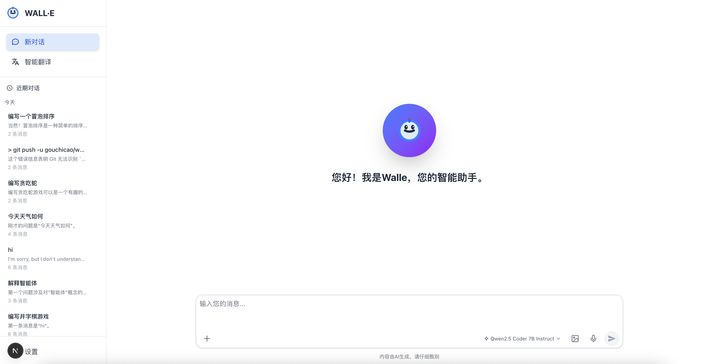
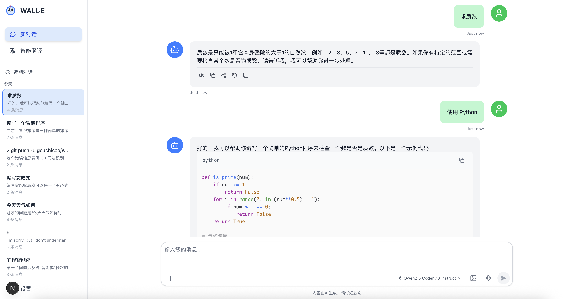

# 🤖 Walle AI Assistant

[](https://nextjs.org/)
[](https://react.dev/)
[](https://www.typescriptlang.org/)
[](https://tailwindcss.com/)
[](https://openai.com/)

A cutting-edge, multi-modal AI assistant built with Next.js 15, featuring advanced capabilities for text, voice, and image interactions. Designed with modern web standards and optimal user experience in mind.





## ✨ Core Features

### 🧠 Advanced AI Capabilities
- **Multi-modal Interaction**: Seamlessly handle text, voice, and image inputs
- **Streaming Responses**: Real-time AI response streaming with SSE (Server-Sent Events)
- **Reasoning Models**: Support for advanced reasoning models (QwQ, Qwen3, GLM-4.1V)
- **Vision Analysis**: AI-powered image understanding and analysis
- **Context Awareness**: Maintains conversation history and context

### 🎨 Modern User Interface
- **Responsive Design**: Optimized for desktop, tablet, and mobile devices
- **Dark/Light Mode**: Automatic theme switching with system preference detection
- **Internationalization**: Complete i18n support (English/Chinese) with react-i18next
- **Accessibility**: WCAG 2.1 AA compliant with screen reader support
- **Smooth Animations**: Fluid transitions and interactive feedback

### 🚀 Performance & Developer Experience
- **Next.js 15**: Latest App Router with Turbopack for lightning-fast builds
- **React 19**: Cutting-edge React features and optimizations
- **TypeScript**: Full type safety with strict mode enabled
- **Modern Tooling**: ESLint, Tailwind CSS 4, and optimized bundling

## �️ Technology Stack

### Frontend
- **Framework**: Next.js 15 with App Router & Turbopack
- **UI Library**: React 19 with modern hooks and Suspense
- **Language**: TypeScript 5 with strict mode
- **Styling**: Tailwind CSS 4 with container queries
- **Icons**: Lucide React for consistent iconography
- **Components**: Custom component library with accessibility

### Backend & AI
- **API Routes**: Next.js serverless functions
- **AI Integration**: OpenAI SDK v5.11.0 with streaming support
- **Model Support**: GPT-4, GPT-4 Vision, reasoning models (QwQ, Qwen3)
- **Image Processing**: Base64 encoding with format validation
- **Streaming**: Server-Sent Events (SSE) for real-time responses

### Development & Deployment
- **Build Tool**: Turbopack for fast development builds
- **Type Checking**: TypeScript with strict configuration
- **Code Quality**: ESLint with Next.js configuration
- **Deployment**: Vercel (recommended) with edge functions
- **Package Manager**: npm with lock file for consistency

## � Quick Start

### Prerequisites
- Node.js 18.17.0 or higher
- npm 9.0.0 or higher
- An OpenAI API key or compatible AI service

### Installation

1. **Clone the repository**:
```bash
git clone https://github.com/gouchicao/walle.git
cd walle
```

2. **Install dependencies**:
```bash
npm install
```

3. **Environment setup**:
```bash
cp .env.example .env.local
```

4. **Configure environment variables** in `.env.local`:
```env
# Required: OpenAI API Configuration
OPENAI_API_KEY=your_openai_api_key_here
OPENAI_BASE_URL=https://api.openai.com/v1

# Optional: Model Configuration
OPENAI_MODEL=gpt-4o-mini
MODEL_LIST=gpt-4o-mini,gpt-4o,gpt-4-vision-preview,Qwen/QwQ-32B

# Optional: Application Settings
NEXT_PUBLIC_APP_NAME=Walle AI Assistant
NEXT_PUBLIC_APP_VERSION=0.1.0
```

5. **Start development server**:
```bash
npm run dev
```

6. **Open your browser** and navigate to [http://localhost:3000](http://localhost:3000)

### Production Deployment

#### Deploy to Vercel (Recommended)
```bash
npm run build
npx vercel --prod
```

#### Build for self-hosting
```bash
npm run build
npm start
```

## ⚙️ Configuration

### Environment Variables

| Variable | Description | Default | Required |
|----------|-------------|---------|----------|
| `OPENAI_API_KEY` | Your OpenAI API key | - | ✅ |
| `OPENAI_BASE_URL` | API base URL (supports OpenAI-compatible services) | `https://api.openai.com/v1` | ❌ |
| `OPENAI_MODEL` | Default AI model | `gpt-4o-mini` | ❌ |
| `MODEL_LIST` | Comma-separated list of available models | - | ❌ |
| `NEXT_PUBLIC_APP_NAME` | Application display name | `Walle AI Assistant` | ❌ |
| `NEXT_PUBLIC_APP_VERSION` | Application version | `0.1.0` | ❌ |

### Supported AI Services

Walle supports multiple OpenAI-compatible AI services:

- **OpenAI**: GPT-4, GPT-4 Vision, GPT-4o models
- **Azure OpenAI**: Enterprise-grade OpenAI services
- **SiliconFlow**: Cost-effective alternative with reasoning models
- **Other Compatible Services**: Any service following OpenAI API standards

**Reasoning Models Support**:
- Qwen/QwQ-32B - Advanced reasoning capabilities
- Qwen/Qwen3-235B-A22B-Thinking-2507 - Enhanced thinking process
- THUDM/GLM-4.1V-9B-Thinking - Visual reasoning model

## 🎯 Usage

### Basic Chat
1. **Text Conversation**: Type your message and press Enter or click Send
2. **Model Selection**: Choose your preferred AI model from the dropdown
3. **Conversation History**: Previous messages are automatically maintained

### Advanced Features
1. **Image Analysis**: 
   - Click the image icon or drag & drop images
   - Supports JPEG, PNG, GIF, WebP formats (max 20MB)
   - Get detailed AI-powered image analysis

2. **Voice Interaction** (Coming Soon):
   - Click the microphone icon to start voice recording
   - Real-time speech-to-text conversion
   - Text-to-speech for AI responses

3. **Reasoning Models**:
   - Select models like QwQ-32B for complex reasoning
   - View the AI's thinking process (reasoning chain)
   - Advanced problem-solving capabilities

## 📖 Documentation

### Core Documentation
- **[📚 Documentation Center](./docs/README.md)** - Complete documentation hub
- **[🛠️ Development Guide](./docs/DEVELOPMENT.md)** - Setup, architecture, and workflows
- **[🔗 API Reference](./docs/API.md)** - RESTful API documentation
- **[📋 Coding Guidelines](./.github/copilot-instructions.md)** - Code standards and practices

### Design & UX
- **[🎨 Robot UX Guide](./docs/robot-ux-optimization.md)** - Animated robot design principles
- **[♿ Accessibility](./docs/DEVELOPMENT.md#-uiux-guidelines)** - WCAG compliance and inclusive design

## 🏗️ Architecture Overview

### Project Structure
```
src/
├── app/                      # Next.js 15 App Router
│   ├── api/                 # Serverless API routes
│   │   ├── chat/           # Main chat endpoint (streaming)
│   │   ├── models/         # Model management
│   │   └── speech/         # Voice processing APIs
│   ├── globals.css         # Global styles & CSS variables
│   ├── layout.tsx          # Root layout with providers
│   └── page.tsx           # Home page component
├── components/             # Reusable React components
│   ├── ChatInterface.tsx   # Main chat UI container
│   ├── MessageList.tsx     # Message display with virtualization
│   ├── MessageBubble.tsx   # Individual message rendering
│   ├── InputArea.tsx       # Multi-modal input handling
│   ├── ErrorBoundary.tsx   # Error handling & recovery
│   ├── AnimatedRobot.tsx   # Status indicator robot
│   └── ...                # UI components (selectors, etc.)
├── types/                  # TypeScript definitions
│   └── chat.ts            # Chat interfaces & types
├── utils/                  # Utility functions
│   ├── performance.ts      # Performance monitoring
│   ├── time.ts            # Time formatting
│   └── voice.ts           # Voice processing utilities
├── config/                 # Configuration files
│   └── voice.ts           # Voice settings & options
└── i18n/                  # Internationalization
    ├── config.ts          # i18next configuration
    └── locales/           # Translation files
        ├── en.json        # English translations
        └── zh.json        # Chinese translations
```

### Key Features Implementation
- **🔄 Streaming**: Server-Sent Events (SSE) for real-time responses
- **🖼️ Multi-modal**: FormData handling for text + image inputs
- **🧠 Reasoning**: Support for thinking/reasoning model outputs
- **📊 Monitoring**: Built-in performance and usage analytics
- **🔒 Security**: Input validation, file type/size restrictions
- **♿ A11y**: Screen reader support, keyboard navigation
## 🛠️ Development

### Available Scripts

```bash
# Development
npm run dev          # Start development server with Turbopack
npm run build        # Build for production
npm run start        # Start production server
npm run lint         # Run ESLint code analysis
npm run type-check   # Run TypeScript type checking
```

### Development Workflow

1. **Setup Environment**:
   ```bash
   git clone https://github.com/gouchicao/walle.git
   cd walle
   npm install
   cp .env.example .env.local
   ```

2. **Development Best Practices**:
   - Follow TypeScript strict mode
   - Use ESLint for code quality
   - Write descriptive commit messages
   - Test across different devices/browsers

3. **Performance Monitoring**:
   ```typescript
   import { performanceMonitor } from '@/utils/performance';
   
   // Track operation performance
   performanceMonitor.start('api-call');
   // ... your code
   performanceMonitor.end('api-call');
   ```

## 🤝 Contributing

We welcome contributions from the community! Here's how you can help:

### Ways to Contribute
- 🐛 **Report Bugs**: Submit detailed bug reports via GitHub Issues
- 💡 **Suggest Features**: Propose new features or improvements
- 📝 **Improve Documentation**: Help make our docs even better
- 🔧 **Submit Code**: Fix bugs or implement new features

### Contribution Process
1. **Fork** the repository to your GitHub account
2. **Clone** your fork locally
3. **Create** a feature branch: `git checkout -b feature/amazing-feature`
4. **Make** your changes with proper tests and documentation
5. **Commit** with descriptive messages: `git commit -m 'Add amazing feature'`
6. **Push** to your branch: `git push origin feature/amazing-feature`
7. **Submit** a Pull Request with a clear description

### Development Guidelines
- Follow the [Coding Standards](./.github/copilot-instructions.md)
- Ensure all tests pass and add new tests for new features
- Update documentation for any changes
- Follow semantic versioning for releases

## 🌟 Community & Support

### Get Help
- 📚 **[Documentation](./docs/README.md)** - Comprehensive guides and references
- 🐛 **[Issues](https://github.com/gouchicao/walle/issues)** - Bug reports and feature requests
- 💬 **[Discussions](https://github.com/gouchicao/walle/discussions)** - Community Q&A and ideas
- 📧 **Email**: contact@walle-ai.com (for business inquiries)

### Stay Updated
- ⭐ **Star** this repository to stay updated
- 👁️ **Watch** for release notifications
- 🐦 **Follow** our updates on social media

## 📊 Project Status

- ✅ **Stable**: Core chat functionality with streaming
- ✅ **Multi-modal**: Text and image support
- ✅ **i18n**: English and Chinese localization
- 🚧 **In Progress**: Voice interaction features
- 🔮 **Planned**: User authentication, conversation history

## 📄 License

This project is licensed under the **MIT License** - see the [LICENSE](LICENSE) file for details.

### What this means:
- ✅ Commercial use allowed
- ✅ Modification allowed
- ✅ Distribution allowed
- ✅ Private use allowed
- ❌ No warranty provided
- ❌ No liability accepted

## 🙏 Acknowledgments

- **OpenAI** for providing powerful AI capabilities
- **Vercel** for excellent deployment platform
- **Next.js Team** for the amazing framework
- **React Team** for the UI library
- **Tailwind CSS** for the styling system
- **Open Source Community** for inspiration and tools

---

<div align="center">

**Built with ❤️ using Next.js 15, React 19, and OpenAI**

[⭐ Star us on GitHub](https://github.com/gouchicao/walle) • [🐛 Report Issues](https://github.com/gouchicao/walle/issues) • [💡 Request Features](https://github.com/gouchicao/walle/discussions)

*Making AI accessible, one conversation at a time.*

</div>
